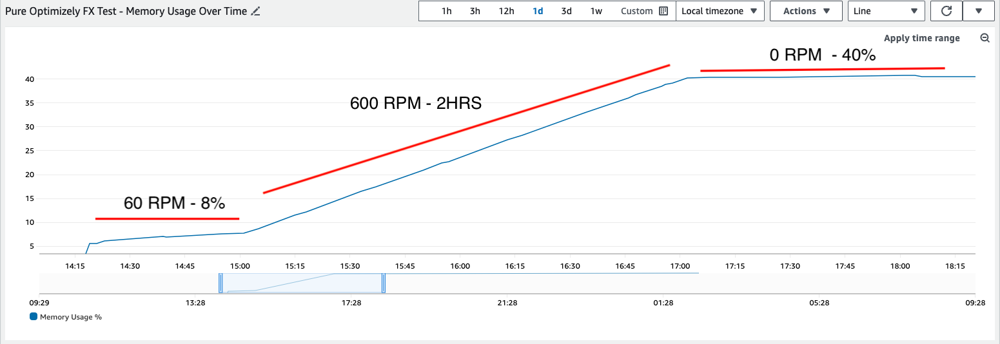
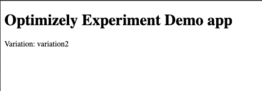

## Overview

The following is a simple server rendered react app that makes use of the optimizely SDK (feature experimentation).

The optimizely client is created once, then reused for the life of the app.
The datafile is fetched once, and then the optimizely client will handle updating as needed.

Using this app, we have found a memory leak. When deployed to AWS ECS, as a 1vCPU, 2GB Memory task we observed the following memory profile when under load:

## Setup

1. Please update the `optimizelyConfig.json` file in the root of this project with your feature experimentation datafile url of choice, and also setup an experiment and provide the experiment id.

In our case, we setup an experiment called `test-experiment` and had it shown to 100% of users, 50% seeing `variation1` and 50% seeing `variation2`

2. If using your host machine, run `nvm use && npm i` to ensure you're using the correct version of node and install dependencies

## Running

### On host

`npm run build` then `npm run start`

### Docker

If using docker, run `auto/start`

## Visiting the app

Once running, the app will be available at http://localhost:3000/

It will show a simple html page with the variation displayed:

The application runs with the `--inspect` flag currently to aid with memory profiling. We did not use this flag when doing the memory test shown in the screenshot earlier as we know the debugging tooling adds some overhead.
